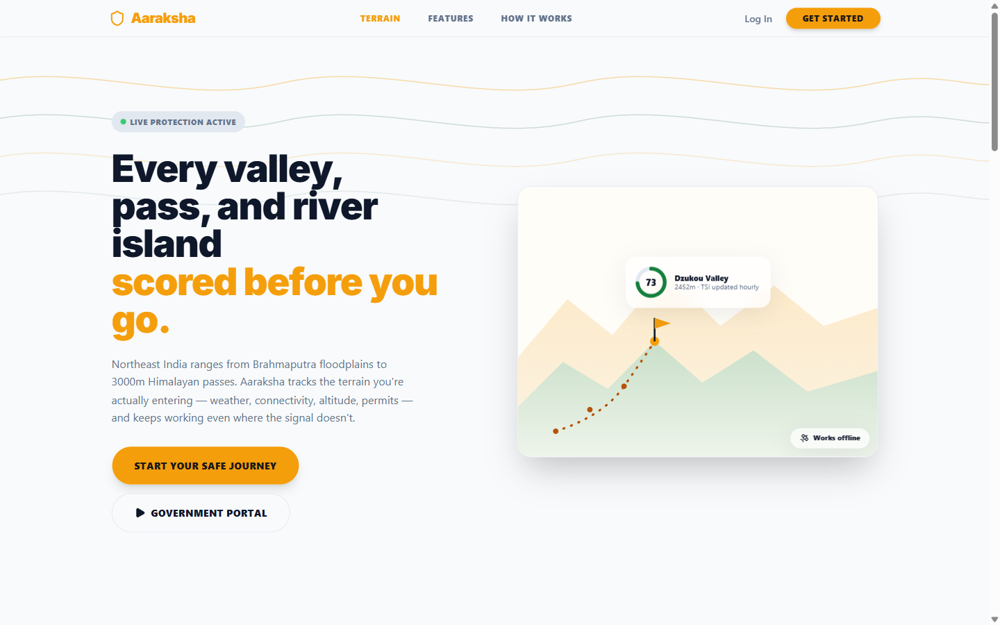
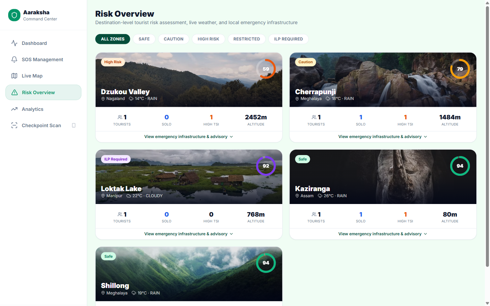
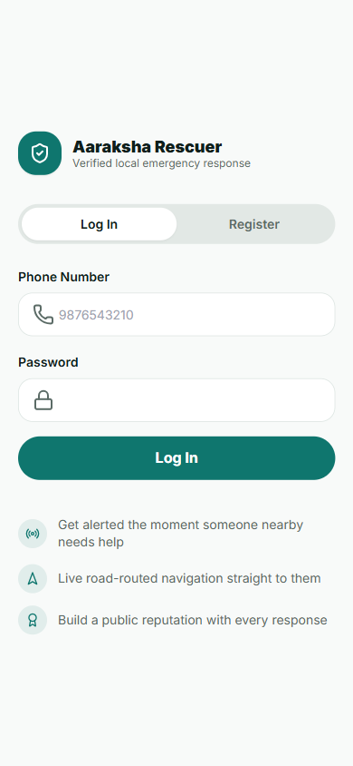
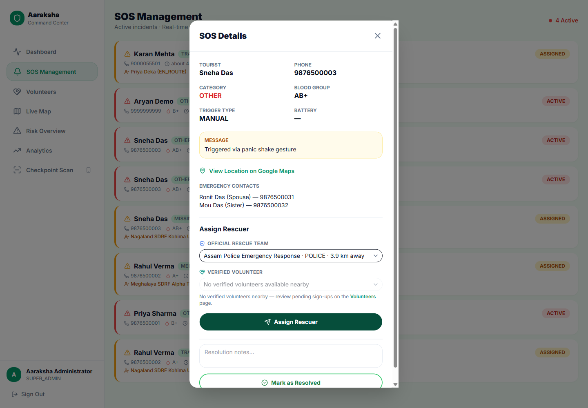
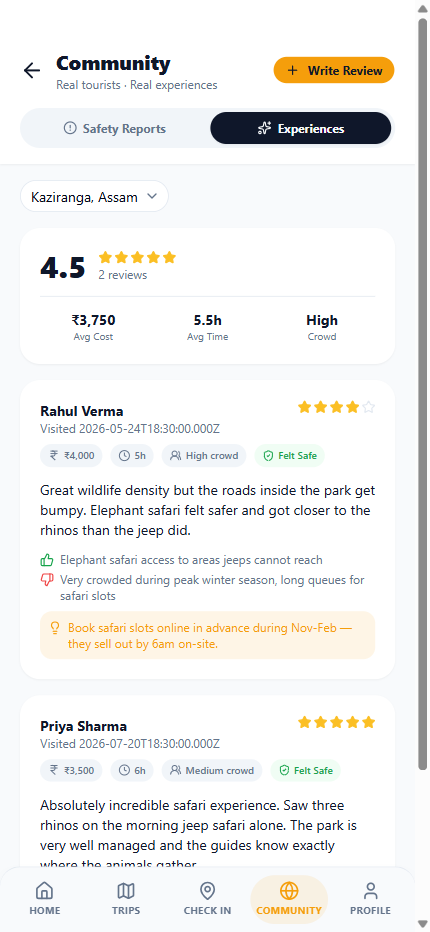
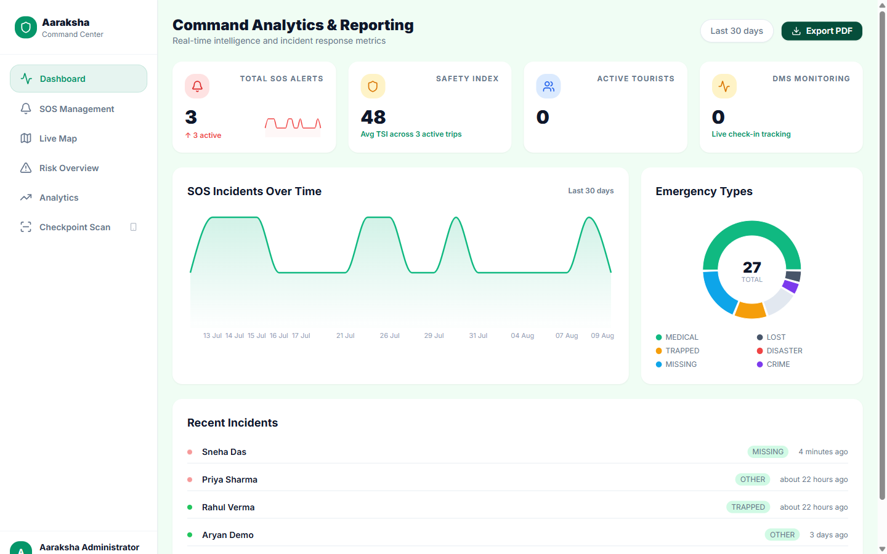
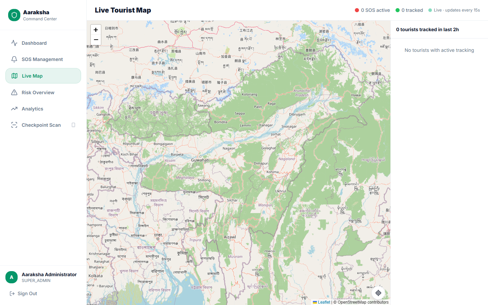
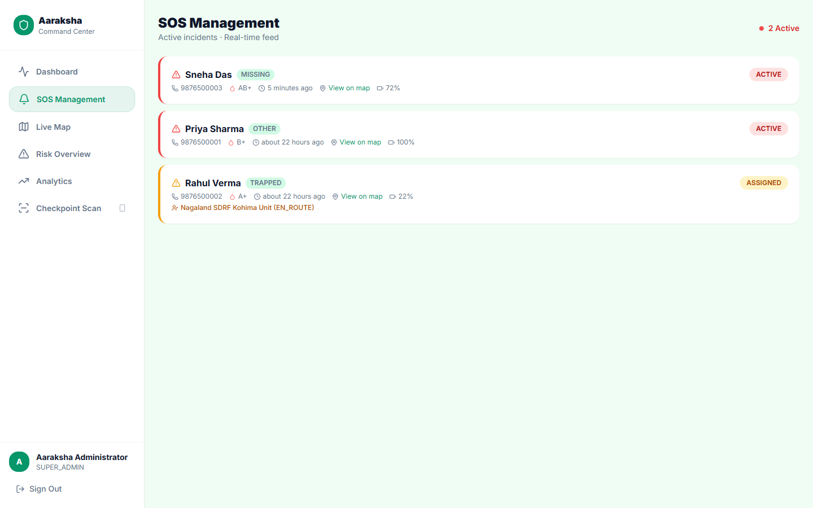
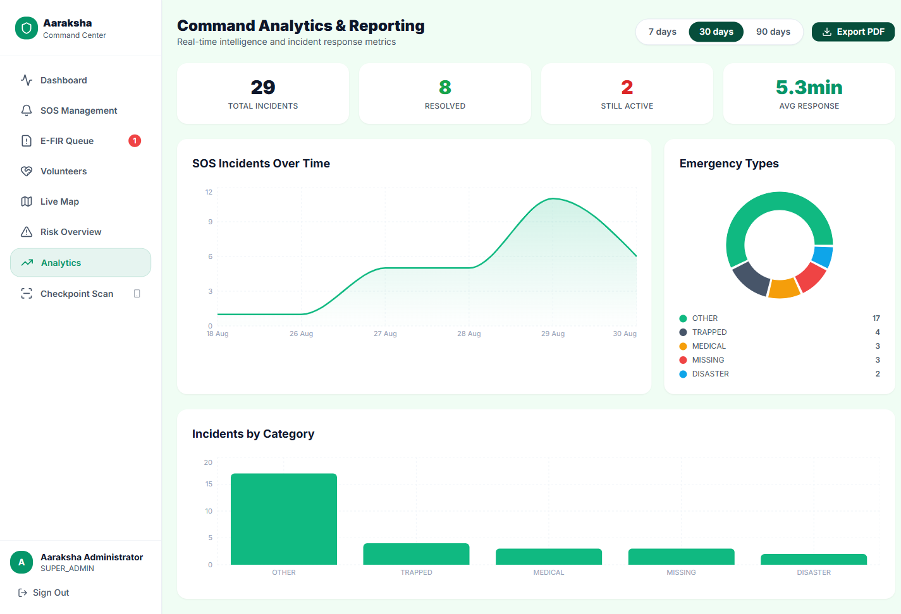
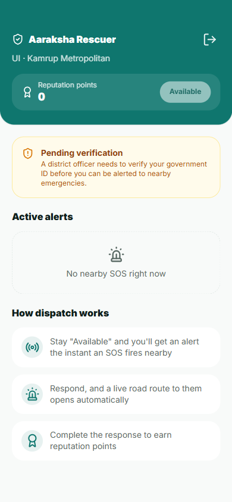

# 🛡️ Aaraksha — Smart Tourism, Safe Journey

**A tourist-safety platform for Northeast India, built for Smart India Hackathon 2025.**

> *Aaraksha* (आराक्षा) — "protection." Not a translation exercise: it's the one-word summary of
> what every screen in this system is trying to do.

[]()
[]()
[]()
[]()
[]()
[]()

---

## The pitch, in one paragraph

Northeast India pulls a growing number of tourists into terrain most safety apps were never
built for: 3000m mountain passes, zero-connectivity valleys, single-lane approach roads, and
districts where the nearest hospital is a two-hour drive. Existing tourism apps stop at
itinerary planning. Existing safety apps assume a phone signal. Aaraksha is built on the
opposite assumption — **that the moment someone needs help is exactly the moment their phone
stops being reliable** — and designs every safety mechanism backward from there: SOS that works
over SMS with zero data, a Dead Man's Switch that fires *for* you if you go silent, a citizen
volunteer network that gets a real turn-by-turn road route the instant they're dispatched, and a
government command center watching the same live picture the tourist sees — tied together by one
real-time data model instead of four disconnected apps.

<p align="center">
  
</p>

---

## Table of contents

- [Building the presentation](#building-the-presentation)
- [Why this wins](#why-this-wins)
- [Four portals, one system](#four-portals-one-system)
- [Feature walkthrough](#feature-walkthrough)
- [The unified Rescuer network](#the-unified-rescuer-network)
- [Screenshots](#screenshots)
- [Architecture at a glance](#architecture-at-a-glance)
- [By the numbers](#by-the-numbers)
- [Repository layout](#repository-layout)
- [Getting started](#getting-started)
- [Demo accounts](#demo-accounts)
- [API surface](#api-surface)
- [Testing](#testing)
- [Production readiness](#production-readiness)
- [Documentation map](#documentation-map)
- [Roadmap](#roadmap)

---

## Building the presentation

This README is written so a slide deck can be built straight off it — every section below maps
to one slide's worth of content, in the order a pitch actually flows. Screenshots are real,
captured from the running app (`docs/screenshots/`), not mockups — drop them straight into
slides.

| # | Slide | Pull from | Notes |
|---|---|---|---|
| 1 | **Title** | The H1 + tagline at the top of this file | "Safety that keeps working after the signal drops" is the whole pitch in one line — use it as the deck's title or opening line |
| 2 | **The problem** | [The pitch, in one paragraph](#the-pitch-in-one-paragraph) | Lead with terrain, not tech: 3048m passes, zero-signal valleys, two-hour hospital drives |
| 3 | **Our bet / thesis** | The pitch paragraph above | One line: *"the moment someone needs help is exactly the moment their phone stops being reliable."* Everything else on the following slides proves this line |
| 4 | **Four portals** | [Four portals, one system](#four-portals-one-system) table + `tourist-landing.png`, `govt-dashboard.png`, `guardian-portal.png`, `rescuer-active-job.png` | One slide, four screenshots side by side — this alone shows more scope than most competing teams |
| 5 | **Live demo / walkthrough script** | [Demo accounts](#demo-accounts) | Don't demo a blank app — log into **Rahul Verma** (`9876500002` / `Demo@123`) to show a *live SOS with a rescue team already en route*, then open his Guardian link to show the same emergency from a family member's view. For the newer unified-rescuer story, use **Karan Mehta** (`9000055501` / `DemoPass123`) — his SOS is assigned to volunteer **Priya Deka**, live-tracked on a real road route. That one flow sells the whole platform in 90 seconds |
| 6 | **Feature highlights** | [Feature walkthrough](#feature-walkthrough) — pick 2–3 lines per pillar, don't read the whole list | Planning → Safety → Unified Rescue Network → Government Ops → Community → Offline-first. Safety and the Rescuer network are the pillars to spend the most slide time on |
| 7 | **Numbers** | [By the numbers](#by-the-numbers) | Drop the whole table on one slide as a stat grid — 78 endpoints, 22 tables, 45 rotating news items land better as bold numbers than as prose |
| 8 | **Why we win** | [Why this wins](#why-this-wins) comparison table | This table is already written as a "typical hackathon app vs. Aaraksha" comparison — use it verbatim as a two-column slide |
| 9 | **Under the hood** *(for technical judges)* | [Architecture at a glance](#architecture-at-a-glance) diagram + [Production readiness](#production-readiness) | Keep this slide for a technical Q&A round — the adversarial-testing bullet points (SQLi, race conditions, forced rollbacks) are the strongest "we didn't just make a demo" evidence in the whole repo |
| 10 | **What's next** | [Roadmap](#roadmap) | Everything on the roadmap is a deliberate, named scope decision — say so explicitly, it reads as intentional prioritization rather than unfinished work |

---

## Why this wins

| What most hackathon safety apps ship | What Aaraksha ships |
|---|---|
| A static "call police" button | A rule-based Travel Safety Index recalculated **hourly from live weather**, scored per destination |
| Safety features that assume signal | **Offline SOS over raw SMS** — no data connection required, a Twilio webhook does the rest |
| One app, one audience | **Four cooperating portals** — tourist, government, a no-login family tracking link, and a dedicated Rescuer app for volunteers and official teams — sharing one real-time data model |
| A mocked/seeded demo that falls apart under a second click | A backend that was **adversarially attacked after launch** — rate-limit bypass attempts, SQLi payloads, concurrent double-resolve races, forced transaction rollbacks — and fixed, not just tested |
| Safety as an isolated feature | Safety **woven into planning** — every trip gets a TSI score before it's even booked, every destination card carries a live risk badge |
| A single "it's a demo" happy path | **Five live demo accounts**, each mid-scenario: an active SOS with a rescue team en route, another already assigned to a live-tracked volunteer, a running Dead Man's Switch, a completed trip ready for PDF export, a fresh account to show onboarding |
| Rescue dispatch as a phone call | A **unified Rescuer network** — official teams and govt-verified citizen volunteers in one assignable pool, live GPS, real OSRM road routing, not a straight line on a map |

---

## Four portals, one system

```
                     ┌──────────────────┐
                     │   PostgreSQL      │  22 tables — raw pg, no ORM
                     │   parameterized   │  see DB_GUIDE.md
                     │   SQL only        │
                     └────────▲──────────┘
                              │
                     ┌────────┴──────────┐
                     │  Express API       │  Route → Middleware → Controller
                     │  (backend/)        │  → Service → Repository
                     │  JWT + RBAC        │  78 endpoints · 13 route groups
                     └─┬───────┬───────┬──┘
              Socket.IO│       │       │  REST (JSON)
              real-time│       │       │
        ┌──────────────┘       │       └──────────────┐
        │              ┌───────┴────────┐              │
        ▼              ▼                ▼              ▼
┌────────────┐ ┌───────────────┐ ┌─────────────┐ ┌─────────────┐
│ 🧭 Tourist  │ │ 🖥️ Govt Command│ │ 👪 Guardian  │ │ 🚑 Rescuer   │
│    PWA      │ │  Center        │ │  Portal      │ │    App       │
│  :5173      │ │  :5174         │ │  :5175       │ │  :5176       │
│  amber ·    │ │  emerald ·     │ │  token-in-   │ │  teal ·      │
│  mobile ·   │ │  desktop ·     │ │  URL, zero   │ │  live GPS ·  │
│  offline    │ │  live ops map  │ │  login       │ │  road routes │
└────────────┘ └───────────────┘ └─────────────┘ └─────────────┘
```

| Portal | Who | What they see |
|---|---|---|
| **Tourist PWA** | The traveler | Plan trips with a real Travel Safety Index, one-tap and gesture-triggered SOS, a Dead Man's Switch, curated destination news, community reviews, and a printable Digital Journey Passport |
| **Govt Command Center** | District officers, dispatchers, checkpoint officers | A live map of every active tourist, SOS triage with a combined team-or-volunteer dispatch panel, volunteer identity verification, district risk overview, QR checkpoint scanning, and incident analytics with PDF export |
| **Guardian Portal** | Family and friends | A single shared link — no account, no app install — showing live location, SOS state, the assigned rescuer's live position on a real road route, battery, and medical info, auto-refreshing every 30 seconds |
| **Rescuer App** | Official rescue teams and govt-verified citizen volunteers | Nearby-SOS alerts, a full-screen live map with a real OSRM road route to the person in need, one-tap "Start navigation," and EN\_ROUTE/ARRIVED self-status reporting |

<table>
<tr>
<td width="25%"></td>
<td width="25%"></td>
<td width="25%"></td>
<td width="25%"></td>
</tr>
<tr>
<td align="center"><sub>Tourist PWA — dashboard</sub></td>
<td align="center"><sub>Govt Command Center — risk overview</sub></td>
<td align="center"><sub>Guardian Portal — live SOS state</sub></td>
<td align="center"><sub>Rescuer App — live road route</sub></td>
</tr>
</table>

---

## Feature walkthrough

### 🧭 Planning
- **Multi-stop itineraries** built from a real destination catalog (10 Northeast India destinations, each with live weather, altitude, connectivity rating, ILP requirements, and nearest-hospital data)
- **AI-generated packing lists** via Google Gemini, with a static offline fallback so the feature never hard-fails
- **Budget tracking** per trip, category breakdowns
- **Group trips** — invite codes, join-by-code, shared itinerary, member roster
- **Digital Journey Passport** — a PDFKit-generated trip summary (itinerary, safety events, check-in history) a tourist can download or share

### 🚨 Safety
- **One-tap SOS** — hold-to-confirm button, 7 incident categories, GPS-first with a last-known-location fallback
- **Panic gesture SOS** — a phone-shake gesture fires the same SOS flow, for when reaching the screen isn't an option
- **Dead Man's Switch** — set a check-in interval before entering low-connectivity terrain; miss it, and the system auto-fires an SOS with your last known location, no action required from you
- **Travel Safety Index (TSI)** — a 0–100 score per destination, rule-based from route difficulty, altitude, connectivity, season, and live OpenWeatherMap data, recalculated hourly by a cron job and pushed live over Socket.IO
- **Offline SOS** — the mechanism this whole platform is built around: a tourist with zero data coverage sends a structured SMS (`AARAKSHA_SOS|ID:...|LAT:...|LNG:...|CAT:...|BATT:...|TIME:...`), a Twilio inbound webhook parses it, and a full SOS event is created exactly as if it came through the app
- **Emergency contact OTP verification** — contacts confirm consent before being registered, closing a real privacy gap
- **Rescue team ETA** — once a team is dispatched, the tourist sees live status and estimated arrival, not silence
- **Weather-triggered risk alerts** — a sudden weather-driven TSI drop pushes a real-time alert to anyone with that destination on their itinerary
- **Web push notifications** — critical alerts reach tourists even when the app isn't open

### 🚑 Unified Rescue Network
- **One assignable rescuer pool** — official rescue teams and govt-verified citizen volunteers, distance-sorted in a single govt dispatch panel, badge-differentiated "Official" vs "Volunteer"
- **Govt-side volunteer onboarding** — review a citizen's self-registration through an explicit identity-confirmation dialog, *or* provision a walk-in responder's account directly with a one-time password, generated and shown once
- **Real OSRM road routing** — every rescuer-to-SOS line on every portal (Rescuer app, Guardian, tourist) is an actual road route, not a straight line, with a graceful straight-line fallback if the routing service is unreachable
- **Live GPS streaming** — a rescuer's position updates over Socket.IO roughly every 9 seconds while en route, moving the marker on the tourist's, guardian's, and govt operator's map without a page refresh
- **Self-service status, govt-owned resolution** — a rescuer reports their own `EN_ROUTE`/`ARRIVED` progress; closing the incident stays an exclusive govt-operator action, matching how a real emergency response chain of custody works

### 🖥️ Government Operations
- **Live ops map** (Leaflet + Socket.IO) — every active tourist, every open SOS, updating in real time, no refresh
- **SOS triage & rescue assignment** — dispatch to the nearest available team *or* volunteer, status tracked live through `EN_ROUTE → ARRIVED → RESOLVED`
- **Volunteer verification & roster** — a pending-review queue with full identity detail before granting dispatch access, plus a live roster showing every volunteer's status and reputation points
- **District risk overview** — per-destination live tourist counts, weather, TSI distribution, and a direct "Post News / Alert" action that fans out to every tourist with that destination on an active itinerary
- **Checkpoint QR scanning** — camera-first scan of a tourist's rotating QR code resolves their full safety profile at a physical checkpoint (ILP posts, park entrances) in one tap, manual entry as a fallback, not the default
- **Analytics & reporting** — incident trends, category breakdowns, average response time, exportable as a real PDF with one click
- **Role-scoped access** — super admin, district admin, and checkpoint officer roles, each seeing only what their role needs

### 🌐 Community & Live Content
- **Rich destination reviews** — ratings plus structured detail (actual cost, time spent, crowd level, felt-safe flag, transport/food/accessibility ratings, liked/disliked notes, photos) — not a star rating in a vacuum
- **Scam / safety reports** — community-sourced, filterable per destination
- **Curated, rotating destination news** — a ~45-item hand-written bank across all 10 destinations, rotated in on a time-slot schedule so the feed visibly changes over a multi-day demo without needing a live news API key
- **Risk overview in the tourist app too** — the same live "how many people are here right now, and how risky is it" view the government dashboard has, surfaced directly to travelers deciding where to go next

### 👪 Guardian Portal
- **Zero-friction access** — a cryptographically random token in the URL, no login, works the instant it's opened
- **Five status states**, each visually distinct: safe, check-in-due warning, SOS active, help-dispatched (amber, distinct from a raw SOS), and no-signal
- **Live rescuer tracking** once help is dispatched — the assigned team or volunteer's real-time position and road route to the traveler, the same picture the govt operator sees
- Live location on a Leaflet map, battery level, medical info (blood group, conditions), auto-refresh every 30s

### 📴 Offline-first
- **IndexedDB (Dexie.js)** queues SOS events and location pings when the tourist app itself is offline, syncing the moment connectivity returns
- **Cached safety guides** — nearest hospital, police, and rescue team contact stay available even with no signal
- Every safety mechanism above degrades gracefully rather than failing outright when a network or third-party API isn't available

---

## The unified Rescuer network

Two kinds of rescuer used to be structurally separate systems: official rescue teams (a shared
phone number, manually dispatched by a govt operator) and citizen volunteers (individually
logged in, only reachable by an automatic proximity broadcast — no manual assignment path
existed, and no live location ever left their registered base). Neither had a real road route or
a live position. This is the actual flow now, end to end, screenshotted from the running app:

**1. A volunteer gets an account** — either they register themselves in the Rescuer app, or a
district officer provisions one directly for a walk-in local responder, generating a one-time
password on the spot.

<p align="center">
  
</p>

**2. A district officer verifies their identity** before they're eligible for dispatch — an
explicit confirm step, not a one-click rubber stamp, since verifying grants access to a
tourist's exact live location the moment they're assigned.

<p align="center">
  
</p>

**3. An SOS comes in, and the govt operator picks a rescuer** — official team or verified
volunteer, in one distance-sorted panel, badge-differentiated so the operator always knows
which kind of rescuer they're sending.

<p align="center">
  
</p>

**4. The Rescuer app opens straight into a live, full-screen map** — a real OSRM road route to
the person in need (not a straight line), live distance/ETA, one-tap handoff to Google Maps
turn-by-turn, and self-reported `EN_ROUTE` → `ARRIVED` progress.

<p align="center">
  
</p>

**5. The family sees the exact same live picture** — the assigned rescuer's real-time position
and road route, on the same no-login Guardian link they already had open.

<p align="center">
  
</p>

The rescuer's position streams over Socket.IO into three rooms at once — tourist, guardian, govt
— so all three views move in near-real-time off the same GPS ticks, not three separate polling
loops drifting out of sync.

---

## Screenshots

All captured live from the running app — real seeded data, not mockups. Full-resolution files
are in [`docs/screenshots/`](./docs/screenshots/), free to drop straight into slides.

**Tourist PWA**

<table>
<tr>
<td width="50%"><p align="center"><sub>Landing page — terrain-themed hero</sub></p></td>
<td width="50%"><p align="center"><sub>Trip detail — live TSI + destination news</sub></p></td>
</tr>
<tr>
<td width="50%"><p align="center"><sub>Community — rich destination reviews</sub></p></td>
<td width="50%"><p align="center"><sub>Dashboard — SOS, DMS, active trips</sub></p></td>
</tr>
</table>

**Govt Command Center**

<table>
<tr>
<td width="50%"><p align="center"><sub>Restricted-access authentication</sub></p></td>
<td width="50%"><p align="center"><sub>Dashboard — live stats at a glance</sub></p></td>
</tr>
<tr>
<td width="50%"><p align="center"><sub>Live Map — every active tourist, real time</sub></p></td>
<td width="50%"><p align="center"><sub>SOS Management — incident triage list</sub></p></td>
</tr>
<tr>
<td width="50%"><p align="center"><sub>Assign Rescuer — official team or verified volunteer</sub></p></td>
<td width="50%"><p align="center"><sub>Volunteers — provisioning + one-time credentials</sub></p></td>
</tr>
<tr>
<td width="50%"><p align="center"><sub>Risk Overview — per-destination live risk</sub></p></td>
<td width="50%"><p align="center"><sub>Analytics — incident trends + PDF export</sub></p></td>
</tr>
</table>

**Guardian Portal** — mobile view, since this is the link a family member opens on their phone

<table>
<tr>
<td width="50%"><p align="center"><sub>SOS active — no rescuer dispatched yet</sub></p></td>
<td width="50%"><p align="center"><sub>Help dispatched — live rescuer + road route</sub></p></td>
</tr>
</table>

**Rescuer App** — the newest portal, teal to stay visually distinct from the other three

<table>
<tr>
<td width="33%"><p align="center"><sub>Log in / register</sub></p></td>
<td width="33%"><p align="center"><sub>Home — availability toggle, nearby alerts</sub></p></td>
<td width="33%"><p align="center"><sub>Active job — live route + status</sub></p></td>
</tr>
</table>

---

## Architecture at a glance

**Backend stack:** Node.js ≥20 · Express · PostgreSQL (raw `pg`, zero ORM) · JWT + bcrypt ·
Socket.IO · node-cron (DMS checks every minute, weather+TSI hourly, news rotation every 20 min) ·
Twilio (outbound SMS + inbound webhook) · Google Gemini · PDFKit · multer (photo uploads) · Zod
validation · pino structured logging.

**Frontend stack** (all four apps, independently deployable Vite projects sharing one design
system — see [`UI_GUIDE.md`](./UI_GUIDE.md)): Vite 8 · React 19 · TypeScript 6 · Tailwind CSS
3.4 · shadcn/ui (Radix primitives) · Zustand · TanStack Query v5 · Dexie.js (tourist offline
sync) · react-leaflet (govt live map, Guardian/tourist/Rescuer live-route maps) · OSRM (real road
routing, no API key) · react-hook-form + Zod · Socket.IO client · jsQR (checkpoint camera
scanning).

Every layer is intentionally narrow: controllers hold no SQL or business logic, all queries live
in repositories, and every multi-table write that must be atomic goes through a single
`withTransaction()` helper. The full mechanism, traced from the actual source, is diagrammed in
the [production readiness report](./PRODUCTION_READINESS_REPORT.html).

---

## By the numbers

| | |
|---|---|
| **Portals** | 4 (Tourist PWA, Govt Command Center, Guardian Portal, Rescuer App) |
| **API endpoints** | 78, across 13 route groups |
| **Database tables** | 22 |
| **Destinations seeded** | 10, across Assam, Meghalaya, Nagaland, Arunachal Pradesh, Sikkim, Manipur — each with real altitude, connectivity, ILP, and hospital data |
| **Curated news items** | ~45, hand-written per destination, auto-rotating |
| **Tourist app screens** | 13+ (landing, auth, dashboard, trip planning + detail with 6 tabs, check-in, SOS, community, advisory, profile) |
| **Govt app screens** | 8 (login, dashboard, SOS management, volunteers, live map, risk overview, analytics, checkpoint scan) |
| **Rescuer app screens** | 3 (auth, home, active job — live map) |
| **Cron jobs** | 3 (Dead Man's Switch monitoring, weather + TSI refresh, destination news rotation) |
| **Real-time events** | 24 distinct Socket.IO event types |
| **SOS incident categories** | 7 (medical, lost, trapped, disaster, missing, crime, other) |
| **Rescuer types** | 2 (official rescue teams, govt-verified citizen volunteers) — one assignable pool |

---

## Repository layout

```
Aaraksha/
├── README.md                        this file
├── Architecture.md                  locked tech stack, naming, directory conventions
├── API_GUIDE.md                     HTTP verbs, error codes, response envelope
├── DB_GUIDE.md                      table definitions, relationships, query rules
├── UI_GUIDE.md                      design tokens, components, offline strategy
├── PRODUCTION_READINESS_REPORT.html architecture dossier + adversarial-testing findings
│
├── backend/
│   ├── src/
│   │   ├── app.js                   Express app: middleware chain, routes, error handler
│   │   ├── server.js                HTTP server, Socket.IO init, graceful shutdown
│   │   ├── config/                  env validation, CORS, Gemini/Twilio/push clients
│   │   ├── constants/                enums, error messages, socket event names
│   │   ├── routes/                  13 route modules → controllers
│   │   ├── controllers/             thin HTTP handlers
│   │   ├── services/                business logic, transaction boundaries
│   │   ├── repositories/            all SQL, parameterized, one per table cluster
│   │   ├── middleware/              auth (JWT), validate (Zod), rate limiting, errors
│   │   ├── validators/              Zod schemas per domain
│   │   ├── socket/                  Socket.IO init + typed emitters
│   │   ├── cron/                    DMS, weather+TSI, destination-news rotation jobs
│   │   ├── data/                    curated destination news bank
│   │   ├── database/                connection pool, transaction helper
│   │   └── migrations/              node-pg-migrate schema — 22 tables across 10 migrations
│   ├── scripts/
│   │   ├── preflight.js             env/DB connectivity check before setup
│   │   ├── seed.js                  idempotent demo data (--reset flag available)
│   │   ├── seedDemoContent.js       trips/reviews/scam reports across every demo account
│   │   └── seedAnalyticsHistory.js  30-day realistic incident history for the analytics dashboard
│   ├── tests/                       vitest unit + integration suite
│   ├── postman/                     Postman collection + environment
│   ├── .env.example                 every required env var, documented
│   └── package.json
│
└── frontend/
    ├── tourist/                     Tourist PWA — :5173
    │   └── src/pages/               landing, auth, dashboard, trips (create/detail/list),
    │                                 safety (SOS/check-in/checkpoint pass), community,
    │                                 advisory, profile
    ├── govt/                        Government Command Center — :5174
    │   └── src/pages/               login, dashboard, SOS management, volunteers,
    │                                 live map, risk overview, analytics, checkpoint scan
    ├── guardian/                    Guardian Portal — :5175
    │   └── src/pages/               tracking page (token in URL, no auth)
    └── volunteer/                   Rescuer App — :5176 (folder name predates the
        │                             rebrand; app-facing copy says "Aaraksha Rescuer")
        └── src/pages/               auth, home (availability + nearby alerts),
                                      active job (live map + road route)
```

---

## Getting started

### Prerequisites
- Node.js ≥ 20
- PostgreSQL ≥ 15 (needs `pgcrypto` for `gen_random_uuid()` — the migration enables it)
- npm

### 1. Clone and install
```bash
git clone https://github.com/aryanf192811-eng/Aaraksha.git
cd Aaraksha/backend
npm install
```

### 2. Configure environment
```bash
cp .env.example .env
```
Fill in `DATABASE_URL` at minimum. `JWT_SECRET`, `GOVT_ID_SECRET`, and `GUARDIAN_SECRET` need
real random values even for local development. Twilio, Gemini, OpenWeatherMap, and Web Push
(VAPID) keys are **optional** — every integration degrades gracefully when unset.

### 3. Set up the database
```bash
npm run preflight     # verifies DATABASE_URL is reachable before anything else runs
npm run migrate       # applies the 22-table schema
npm run seed          # idempotent demo data — safe to re-run
```
Or all three in one shot: `npm run setup`.

Two optional scripts add richer demo content on top of the base seed:
```bash
node scripts/seedDemoContent.js       # more trips, reviews, and scam reports per account
node scripts/seedAnalyticsHistory.js  # 30 days of realistic resolved-incident history
```

### 4. Run the backend
```bash
npm run dev            # nodemon, auto-restart
```
Starts on `PORT` (default `5000`), logs `GET /health → {"status":"ok"}` once ready.
Socket.IO and all three cron jobs start automatically.

### 5. Run the frontends
Each app is a separate Vite project on a fixed port. In four more terminals:
```bash
cd frontend/tourist   && cp .env.example .env && npm install && npm run dev   # → :5173
cd frontend/govt      && cp .env.example .env && npm install && npm run dev   # → :5174
cd frontend/guardian  && cp .env.example .env && npm install && npm run dev   # → :5175
cd frontend/volunteer && cp .env.example .env && npm install && npm run dev   # → :5176 (Rescuer App)
```
The `.env.example` defaults work out of the box against a local backend. To test from another
device on the same network, point each `VITE_API_URL` / `VITE_SOCKET_URL` at your machine's LAN
IP instead of `localhost` (all four dev servers already bind to `0.0.0.0`). Road routing calls
the free public OSRM demo server directly from the browser — no API key, nothing to configure.

---

## Demo accounts

Seeded by `npm run seed` — each tourist account is mid-scenario, not a blank slate:

| Account | Login | Scenario |
|---|---|---|
| Aryan Demo | `9999999999` / `Demo@123` | Active trip, 1 check-in, 1 resolved SOS |
| Priya Sharma | `9876500001` / `Demo@123` | Completed trip, passport-ready (check-ins, activities, packing list) |
| Rahul Verma | `9876500002` / `Demo@123` | Active trip with a live unresolved SOS + **official rescue team** en route |
| Sneha Das | `9876500003` / `Demo@123` | Active trip with a running Dead Man's Switch |
| Karan Mehta | `9000055501` / `DemoPass123` | **SOS assigned to a volunteer (not a team), EN\_ROUTE with a live GPS fix** — open the Rescuer app as Priya Deka below to see it live |

| Govt role | Login |
|---|---|
| Super Admin | `admin@aaraksha.gov.in` / `Admin@123` |
| District Admin | `district.officer@aaraksha.gov.in` / `District@123` |
| Checkpoint Officer | `checkpoint.officer@aaraksha.gov.in` / `Checkpoint@123` |

| Rescuer App login | Scenario |
|---|---|
| Priya Deka — `9000055503` / `DemoPass123` | Verified volunteer, already `EN_ROUTE` to Karan Mehta above — logs straight into the live-navigation screen |

The Guardian Portal needs no login — copy any tourist's guardian token (visible on their Profile
page) into `/track/:token` on the guardian app.

---

## API surface

78 REST endpoints across 13 route groups, all under `/api`:

| Prefix | Covers |
|---|---|
| `/auth` | Tourist + govt registration/login, forgot-password OTP flow, phone verification |
| `/tourists` | Profile, emergency-contact OTP verification, checkpoint QR code, public guardian view |
| `/trips` | Itinerary CRUD, stops, group trips (join/invite/members/leave), per-trip news, TSI |
| `/sos` | Create SOS, history, active rescue info, mark false alarm |
| `/dms` | Dead Man's Switch create/reset/status |
| `/checkins` | Manual check-ins |
| `/destinations` | Catalog, weather cache, risk overview, per-destination news, reviews |
| `/scam-reports` | Community-reported safety incidents |
| `/packing` | AI-generated packing checklists |
| `/journey-passport` | PDF trip summary generation |
| `/govt` | Dashboard, live tourists, risk overview, SOS assignment/resolution to a team *or* volunteer, nearby-rescuer search, rescue teams, volunteer provisioning/verification/roster, checkpoint scan, analytics + PDF export, destination news posting |
| `/volunteers` | Volunteer register/login, status + live location updates, active-assignment lookup, EN\_ROUTE/ARRIVED self-status |
| `/webhooks` | Twilio inbound SMS (offline SOS) |
| `/push` | Web push subscribe/unsubscribe, VAPID public key |

Full request/response contracts, status codes, and the response envelope shape are in
[`API_GUIDE.md`](./API_GUIDE.md).

---

## Testing

**Unit + integration (vitest)**
```bash
cd backend
npm test
```
Covers pure logic (TSI scoring, crypto utilities) and integration flows against
`DATABASE_TEST_URL`. Each of the four frontends also carries its own vitest suite (91 tests
total across tourist/govt/guardian/volunteer) — `cd frontend/<app> && npm test`. CI
(`.github/workflows/test.yml`) runs the backend suite against a real ephemeral Postgres and
matrixes the frontend suite across all four apps on every push and pull request.

**API contract tests (Postman/Newman)**
```bash
cd backend
npx newman run postman/aaraksha-collection.json -e postman/aaraksha-environment.json
```
Covers the core auth/trip/SOS/DMS/govt surface. The community reviews, news rotation, group
trips, push-notification, and unified-rescuer endpoints were added after this collection and
have instead been verified through live, real-network end-to-end testing across all four running
portals (Playwright-driven — real logins, real form submissions, real network requests inspected,
real DB rows confirmed) rather than through Postman assertions yet.

---

## Production readiness

Passing the test suite proves the API matches its contract. It doesn't prove the API survives
someone actively trying to break it. The backend went through a second, adversarial pass — real
payloads fired at a live server, not code review:

- **Rate limiting** — burst traffic against `/login`; found the limiter was defined but never
  wired to a route, then found a second bug (a shared limiter instance draining budget across
  unrelated routes). Both fixed.
- **SQL injection** — `' OR 1=1 --`, `DROP TABLE`, `UNION SELECT` against login/search/profile
  fields. Held — parameterized queries throughout.
- **Concurrency** — two parallel resolve requests on the same SOS both returned 200 before the
  fix, silently clobbering each other's resolution notes. Fixed with an atomic DB-level guard.
- **Transaction rollback** — deliberately forced a mid-transaction foreign-key violation;
  confirmed the preceding insert did not survive the rollback.
- **External service failure** — Twilio, Gemini, and OpenWeatherMap all unconfigured; confirmed
  every integration degrades gracefully rather than failing the request.
- **Malformed input** — a SQLi-shaped string in a phone field crashed with an unhandled 500
  before the fix; now a clean 400.

Five real defects were found and fixed this way. The full findings, plus 13 hand-drawn diagrams
tracing the actual request pipeline, transaction boundaries, and SOS/DMS/TSI lifecycles from the
real source code, are in
**[`PRODUCTION_READINESS_REPORT.html`](./PRODUCTION_READINESS_REPORT.html)**.

---

## Documentation map

| Document | Read it when |
|---|---|
| [`Architecture.md`](./Architecture.md) | You're making a stack, naming, or directory-structure decision |
| [`API_GUIDE.md`](./API_GUIDE.md) | You're calling or adding an endpoint |
| [`DB_GUIDE.md`](./DB_GUIDE.md) | You're writing a query or touching the schema |
| [`UI_GUIDE.md`](./UI_GUIDE.md) | You're building one of the four frontends |
| [`PRODUCTION_READINESS_REPORT.html`](./PRODUCTION_READINESS_REPORT.html) | You want architecture diagrams + adversarial-testing evidence |

---

## Roadmap

Everything above is built and working end-to-end. What's next:

- [ ] **Live rescuer marker on the govt ops map** — `SOSManagementPage` already shows a rescuer's
      name and `EN_ROUTE`/`ARRIVED` status live; the govt Live Map itself still renders only
      tourist markers, not the rescuer's moving position and road route the Rescuer/Guardian/
      tourist apps already show. Same `RESCUER_LOCATION_UPDATE` event, just not consumed there yet.
- [ ] Postman collection coverage for the unified-rescuer endpoints (`/govt/volunteers/*`,
      `/govt/sos/:id/nearby-rescuers`, `/volunteers/me/*`) — currently verified live, not via
      checked-in Postman assertions (see [Testing](#testing))
- [ ] Real Twilio/Gemini/OpenWeatherMap/VAPID credentials wired in for the live demo environment

---

*Built for Smart India Hackathon 2025 — Travel & Tourism track.*
